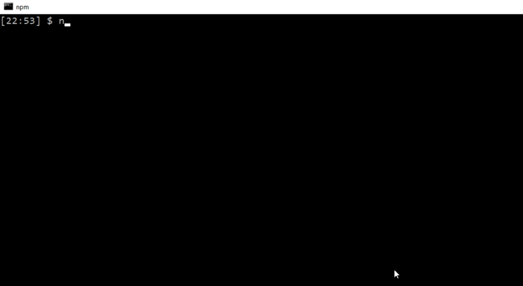

# bamazon
Need a "Fantasy Costco" for your roleplaying game?  BAM!azon is a simple node-based inventory management system for a general goods store that allows customers to place orders for items organized in open-ended categories. Managers can then add additional inventory when necessary, or extend product lines by adding new items when necessary.

# Features
* Add custom items to your store
* Allow customers to order items quickly and simply
* View which products are low in stock and add inventory
* Add custom categories (departments) for your inventory and track profits

# Installation
* Clone this git repository
* On your local machine, set up a mysql database using the code found in dbSetup.sql
* Run 'npm install' to install BAM!azon along with its dependencies:
    MySQL
    Dotenv
    Inquirer
    Console.table

# Using BAM!azon
## Customer
Customers are able to place orders for BAM!azon products using the bamazonCustomer.js script. They can view what items are currently in stock and request an amount to order. Once their order goes through, BAM!azon will keep track of sales for each product.

## Manager
Managers are the storekeepers who keep track of inventory and replenishment for all goods in a BAM!azon store. They also have the ability to add brand new products to their wares.

1. **View Products For Sale**
View all products carried in their store, whether in stock or not. 

2. **Viw Low Inventory**
View all products with current stock less than 5 units on hand. 

3. **Add To Inventory**
When a manager receives additional units of an item, they may use this feature to record that an item is back in stock. They enter the item id of the product in question, as well as how much stock to add.

4. **Add New Product**
If a manager receives a brand new product to put on their shelves, they can record important attributes and put it for sale via BAM!azon in a few easy steps. 

## Supervisor
Supervisors are one level above managers and have additional access to sales information across the entire business. They are able to view net sales and profit by category, as well as define new categories.
1. **View All Departments**
Displays the department name, id, overhead cost, total product sales, and net profits for each department.

2. **Add a New Department**
Allows the supervisor to create a brand new department by asking for a department name and projected overhead cost.